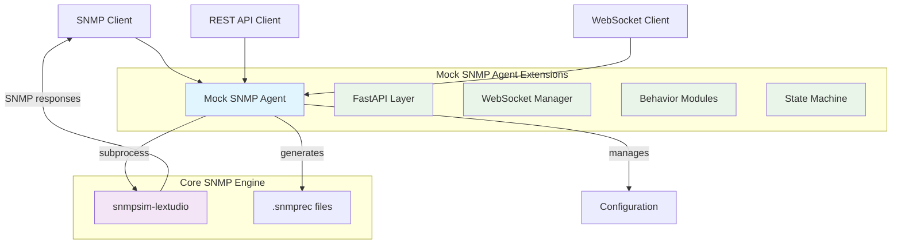

# 🚀 Mock SNMP Agent - The Ultimate SNMP Testing Powerhouse

[](LICENSE)
[](https://python.org)
[](Dockerfile)
[](docs/api/API_TESTING_GUIDE.md)
[](docs/api/REST_API_DOCUMENTATION.md)
[](docs/development/PERFORMANCE_RESULTS.md)

## 💡 Stop Wasting Time with Physical Devices!

**Testing SNMP monitoring is HARD.** You need routers, switches, servers - each with different behaviors, errors, and edge cases. Physical labs are expensive. Virtual devices are limited. **Until now.**

Mock SNMP Agent is your **secret weapon** for SNMP testing:
- 🎯 **Simulate ANY device behavior** - from perfect conditions to total chaos
- ⚡ **240+ requests/second performance** - stress test your monitoring at scale
- 🔥 **Real-time control via REST API** - change behaviors on-the-fly during tests
- 🐛 **Reproduce production bugs instantly** - counter wraps, timeouts, auth failures
- 🚀 **Docker-ready in 30 seconds** - no complex setup, just `docker compose up`

## ⚡ Why Developers Love Mock SNMP Agent

### 🎯 Battle-Test Your SNMP Monitoring Against Real-World Chaos

**The 8 SNMP Nightmares We Help You Conquer:**
1. 📈 **Counter Wraps** - Watch your monitoring break when 32-bit counters overflow!
2. 🔥 **Resource Exhaustion** - Simulate devices dying under load
3. 🌐 **Network Chaos** - Packet loss, delays, timeouts - we got 'em all
4. 💀 **Agent Crashes** - Test resilience when agents randomly disappear
5. ❌ **Error Storms** - Generate every SNMP error known to mankind
6. 📊 **Bulk Operation Stress** - Push GetBulk to its breaking point
7. 🎢 **Dynamic Value Rollercoasters** - Values that change faster than you can poll
8. 🔐 **Auth & Crypto Failures** - Break SNMPv3 in creative ways

### 💪 Packed with Power Features:

🔧 **Protocol Support** • SNMPv1/v2c/v3 • GET/GETNEXT/GETBULK/SET • Full auth & crypto

🎮 **Total Control** • REST API for everything • WebSocket real-time streams • Change behaviors mid-test

🧪 **Simulation Engine** • Inject delays & errors • Simulate device reboots • Create custom chaos

✅ **Production Ready** • 78+ automated tests • CI/CD optimized • Docker native

⚡ **Blazing Fast** • 240+ requests/sec • Sub-70ms latency • Scales horizontally

## 🎮 Master the 8 SNMP Testing Boss Battles

**Level up your monitoring game by defeating these legendary challenges:**

### 🏆 Boss Battle #1: The Counter Wrap Monster
*Your 32-bit counters just hit 4,294,967,295... what happens next?*
```bash
curl -X POST http://localhost:8080/behavior/counter-wrap \
  -d '{"counter_type": "32bit", "acceleration_factor": 1000}'
```

### 💥 Boss Battle #2: The Resource Exhaustion Dragon
*Device at 99% CPU and counting...*

### 🌪️ Boss Battle #3: The Network Chaos Demon
*50% packet loss, 2-second delays, random timeouts*

### ☠️ Boss Battle #4: The Vanishing Agent Ghost
*Now you see me, now you don't*

### 🚨 Boss Battle #5: The Error Response Hydra
*noSuchName! authorizationError! genErr! All at once!*

### 📊 Boss Battle #6: The Bulk Operation Titan
*Can your system handle 10,000 OIDs in one request?*

### 🎢 Boss Battle #7: The Dynamic Value Shapeshifter
*Values changing faster than your polling interval*

### 🔒 Boss Battle #8: The Authentication Sphinx
*Wrong password? Wrong engine ID? Wrong everything!*

**[⚔️ Start Your Quest - Advanced Testing Guide](docs/guides/ADVANCED_TESTING_GUIDE.md)**

## 🚀 From Zero to Testing in 30 Seconds

**Warning: This might be the easiest SNMP simulator setup you've ever done.**

### 📋 Before You Begin

**You'll need:**
- 🐍 **Python 3.8+** (or just use Docker!)
- 🔧 **SNMP tools** for testing:
  ```bash
  # macOS users
  brew install net-snmp

  # Linux crew
  sudo apt-get install snmp snmp-mibs-downloader

  # Red Hat family
  sudo yum install net-snmp-utils
  ```

### 🐳 The Docker Express Lane (Recommended)

**Step 1: Grab the code**
```bash
git clone https://github.com/mhuot/mock-snmp-agent.git
cd mock-snmp-agent
```

**Step 2: Launch the beast**
```bash
docker compose up -d
```

**Step 3: There is no step 3!** 🎉 You're already testing!

### 🎮 Take It For a Spin

**Test drive with SNMPv2c:**
```bash
# Ask for system description
snmpget -v2c -c public 127.0.0.1:11611 1.3.6.1.2.1.1.1.0
# Response: "Mock SNMP Agent - Ready to simulate chaos!"
```

**Level up with SNMPv3 security:**
```bash
# Full encryption and authentication
snmpget -v3 -l authPriv -u simulator -a MD5 -A auctoritas \
    -x DES -X privatus -n public 127.0.0.1:11611 1.3.6.1.2.1.1.1.0
```

**🔥 Pro tip:** Want to see it break things? Check out our [chaos engineering examples](docs/examples/README.md)!

## 🏗️ Architecture: Built Like a Tank, Runs Like a Ferrari

**We didn't reinvent the wheel - we put a turbocharger on it!**



**🏆 Why Our Architecture Rocks:**
- **🔒 Rock-Solid Foundation**: Built on battle-tested snmpsim-lextudio
- **🏗️ Smart Layering**: Core SNMP stays pure, our magic happens on top
- **📡 100% Standards Compliant**: Real SNMP, not some half-baked simulation
- **🚀 Enterprise Features**: REST API, WebSockets, and chaos engineering built-in

**🔧 Under the Hood:**
- **Engine**: `snmpsim-lextudio` - The V8 of SNMP simulators
- **Control**: FastAPI REST API - Change behaviors without restarts
- **Real-time**: WebSocket streams - Watch the chaos unfold live
- **Behaviors**: Pluggable modules - Counter wraps, delays, errors, oh my!

**Result:** Industrial-strength SNMP testing that won't let you down! 💪

## 📚 Level Up Your SNMP Testing Game

**Choose your adventure:**

### 🎮 **Master the Controls**
- 🚀 **[REST API Mastery](docs/api/REST_API_DOCUMENTATION.md)** - Control everything via HTTP
- 📡 **[WebSocket Magic](docs/api/REST_API_DOCUMENTATION.md#websocket-endpoints)** - Real-time monitoring streams

### ⚔️ **Advanced Battle Tactics**
- 🎯 **[Configuration Wizardry](docs/guides/CONFIGURATION_GUIDE.md)** - YAML configs that do amazing things
- 🏆 **[8 Boss Battles Guide](docs/guides/ADVANCED_TESTING_GUIDE.md)** - Defeat every SNMP challenge
- 🔧 **[Power User Secrets](docs/guides/ADVANCED_USAGE_GUIDE.md)** - SNMPv3, tool integration, and more

### 📊 **Prove Your Prowess**
- ✅ **[Test Suite Command Center](docs/api/API_TESTING_GUIDE.md)** - 78+ tests at your command
- ⚡ **[Performance Benchmarks](docs/development/PERFORMANCE_RESULTS.md)** - See how fast we really are

### 🛠️ **Developer Toolkit**
- 🗺️ **[Code Map](docs/development/PROJECT_STRUCTURE.md)** - Navigate the codebase like a pro
- 🐛 **[Troubleshooting HQ](docs/guides/TROUBLESHOOTING.md)** - When things go sideways

### 🎨 **Show & Tell**
- 💡 **[Example Gallery](docs/examples/README.md)** - Copy, paste, customize
- 🖥️ **[React UI Plans](REACT_UI_PROJECT_PLAN.md)** - The future is visual

## 📊 Prometheus Integration: Test Your Monitoring Like a Pro

**Stop hoping your Prometheus SNMP monitoring works. KNOW it works!**

### 🚀 **Launch a Complete Monitoring Stack in 60 Seconds**

**Create `docker-compose.prometheus.yml`:**
```yaml
version: '3.8'
services:
  # Mock SNMP Agent
  mock-snmp-agent:
    image: mock-snmp-agent:latest
    ports:
      - "11611:161/udp"
      - "8080:8080"
    environment:
      - PYTHONWARNINGS=ignore

  # Prometheus SNMP Exporter
  snmp-exporter:
    image: prom/snmp-exporter:latest
    ports:
      - "9116:9116"
    volumes:
      - ./snmp.yml:/etc/snmp_exporter/snmp.yml

  # Prometheus Server
  prometheus:
    image: prom/prometheus:latest
    ports:
      - "9090:9090"
    volumes:
      - ./prometheus.yml:/etc/prometheus/prometheus.yml
```

### **SNMP Exporter Configuration**

Create `snmp.yml` for the SNMP exporter:
```yaml
default:
  walk:
    - 1.3.6.1.2.1.1    # System info
    - 1.3.6.1.2.1.2    # Interface table
    - 1.3.6.1.2.1.31   # High-capacity interface counters
  metrics:
    - name: sysUpTime
      oid: 1.3.6.1.2.1.1.3.0
      type: gauge
    - name: ifInOctets
      oid: 1.3.6.1.2.1.2.2.1.10
      type: counter
      indexes:
        - labelname: ifIndex
          type: gauge
    - name: ifHCInOctets
      oid: 1.3.6.1.2.1.31.1.1.1.6
      type: counter
      indexes:
        - labelname: ifIndex
          type: gauge
  version: 2
  auth:
    community: public
```

### **Prometheus Configuration**

Create `prometheus.yml`:
```yaml
global:
  scrape_interval: 15s

scrape_configs:
  - job_name: 'snmp'
    static_configs:
      - targets:
        - 127.0.0.1:11611  # Mock SNMP Agent
    metrics_path: /snmp
    params:
      module: [default]
    relabel_configs:
      - source_labels: [__address__]
        target_label: __param_target
      - source_labels: [__param_target]
        target_label: instance
      - target_label: __address__
        replacement: snmp-exporter:9116
```

### **Start the Stack**
```bash
docker compose -f docker-compose.prometheus.yml up -d
```

### 💥 **Trigger Counter Wrap Chaos**

**Watch Prometheus freak out (or handle it gracefully):**

```bash
# Enable 32-bit counter wrap simulation
curl -X POST http://localhost:8080/behavior/counter-wrap \
  -H "Content-Type: application/json" \
  -d '{
    "interface_speed": 1000000000,
    "counter_type": "32bit",
    "acceleration_factor": 100
  }'

# Monitor in Prometheus
# Query: rate(ifInOctets[5m]) * 8  # Convert to bits/sec
```

### **Monitoring ifXTable High-Capacity Counters**

```bash
# Enable ifXTable simulation
curl -X POST http://localhost:8080/behavior/ifxtable \
  -H "Content-Type: application/json" \
  -d '{
    "interfaces": [
      {
        "index": 1,
        "speed": 10000000000,
        "traffic_pattern": "business_hours"
      }
    ]
  }'

# Prometheus queries:
# rate(ifHCInOctets[5m]) * 8                    # Interface utilization
# (rate(ifHCInOctets[5m]) * 8) / ifHighSpeed   # Utilization percentage
```

### **Error and Delay Testing**

```bash
# Test SNMP timeout handling
curl -X POST http://localhost:8080/simulation/delay \
  -H "Content-Type: application/json" \
  -d '{"delay_ms": 2000}'

# Test SNMP error responses
curl -X POST http://localhost:8080/simulation/error \
  -H "Content-Type: application/json" \
  -d '{"error_type": "authorizationError", "probability": 0.1}'
```

### **Real-time Monitoring**

Monitor the testing via WebSocket:
```bash
# Watch SNMP activity in real-time
wscat -c ws://localhost:8080/ws/snmp_activity

# Monitor metrics
wscat -c ws://localhost:8080/ws/metrics
```

### **Useful Prometheus Queries**

```promql
# Interface utilization percentage
(rate(ifHCInOctets[5m]) * 8) / (ifHighSpeed * 1000000) * 100

# Counter wrap detection
increase(ifInOctets[5m]) < 0

# SNMP scrape success rate
rate(snmp_scrape_duration_seconds_count[5m])

# Error rate monitoring
rate(snmp_request_errors_total[5m])
```

**🎯 Bottom line:** Test every nightmare scenario BEFORE it happens in production!

## 🏆 Why Mock SNMP Agent Dominates

### **The Competition:**
❌ Physical devices = $$$$ and limited scenarios
❌ Basic simulators = Static responses, no real-world chaos
❌ Virtual appliances = Heavy, slow, still limited

### **Mock SNMP Agent:**
✅ **Infinite Scenarios** - Simulate anything from perfect to apocalypse
✅ **Lightning Fast** - 240+ req/sec, Docker-ready in seconds
✅ **Total Control** - REST API changes everything on-the-fly
✅ **Real-World Chaos** - Counter wraps, crashes, errors - we got it all
✅ **CI/CD Native** - Built for automation from day one

**🎯 One tool. Every scenario. Zero compromises.**

## 🤝 Join the Revolution

### **Found a bug?** 🐛
→ [Report it here](https://github.com/mhuot/mock-snmp-agent/issues) - We actually fix them!

### **Want to contribute?** 💪
→ [Developer guide](docs/development/CLAUDE.md) - PRs welcome!

### **Need help?** 🆘
→ Check our [guides](#-level-up-your-snmp-testing-game) or open an issue

## 📄 License

**Apache 2.0** - Use it, fork it, sell it, we don't care! Just test your SNMP! 🚀

Built on [snmpsim-lextudio](https://github.com/lextudio/snmpsim) (BSD licensed) because we believe in standing on the shoulders of giants.

## 🔗 The SNMP Testing Ecosystem

**Our friends in the SNMP world:**
- 🏗️ [snmpsim-lextudio](https://github.com/lextudio/snmpsim) - The engine that powers us
- 📦 [snmpsim-data](https://github.com/lextudio/snmpsim-data) - More devices to simulate
- 🏢 [snmpsim-control-plane](https://github.com/lextudio/snmpsim-control-plane) - Enterprise control
- 🐍 [pysnmp-lextudio](https://github.com/lextudio/pysnmp) - Python SNMP magic
- 🔧 [net-snmp](http://www.net-snmp.org/) - The classic tools

---

**🚀 Ready to revolutionize your SNMP testing?**

```bash
git clone https://github.com/mhuot/mock-snmp-agent.git && cd mock-snmp-agent && docker compose up -d
```

**Welcome to the future of SNMP testing!** 🎉
